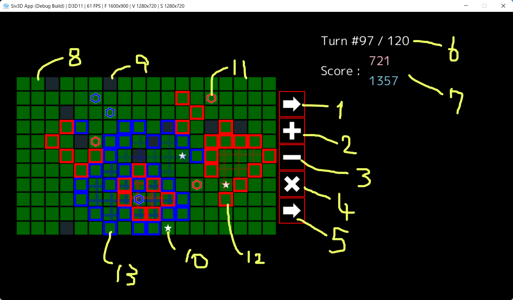

# ビジュアライザ操作方法

## レイアウト

※ 詳細は変更されている可能性があります。

- 1 : 「移動」ボタン
- 2 : 「建築」ボタン
- 3 : 「解体」ボタン
- 4 : 「滞在」ボタン
- 5 : ターン終了ボタン
- 6 : 現在の経過ターン数
- 7 : 得点
- 8 : 「平地」
- 9 : 「城」
- 10 : 「池」
- 11 : 「職人」
- 12 : 赤の「城壁」
- 13 : 青の「城壁」

## キー入力で操作する場合

ターン中に、各職人（エージェント）に指示を出す。エージェントを選択するためには 1 ～ 6 のキーを使用する。選択されたエージェントの位置には専用のカーソルが表示される。また、 Tab キーを使用することでカーソルを動かせる。

エージェント選択中に上下左右矢印キーを押すと、その方向に矢印が表示される。斜めはキー 2 個の同時押しで指定する。

エージェント指定中に各命令に対応するキーを押すと、指示の設定を試行する。

- Q キーで移動
- W キーで建築
- E キーで解体
- R キーで滞在

ボタン（赤枠の四角）内部が青緑に光った場合は、指示が正常に設定されたことを表す。赤色に光った場合は、指示が設定されなかったことを表す。操作が不足していたり、明らかに不正な指示は、設定されずに破棄される。

デフォルトでは滞在が設定されているので、すべてのエージェントで指示を設定しなくてもよい。

エージェントへの指示の設定が完了したら、 Enter キーで次のターンに進む。

## マウスで操作する場合

ターン中に、各職人（エージェント）に指示を出す。エージェントを選択するためには Tab キーを使用する。

エージェント指定中に各指示に対応するボタン（赤枠の四角）をクリックまたはフリックすることでエージェントに指示できる。マウスポインタを動かしてからクリックを離すと、その方向にフリックできる。方向を指定する必要がある指示ではフリックが必要である。

ボタン内部が青緑に光った場合は、指示が正常に設定されたことを表す。赤色に光った場合は、指示が設定されなかったことを表す。操作が不足していたり、明らかに不正な指示は、設定されずに破棄される。

デフォルトでは滞在が設定されているので、すべてのエージェントで指示を設定しなくてもよい。

エージェントへの指示の設定が完了したら、ターン終了ボタンをクリックする。
